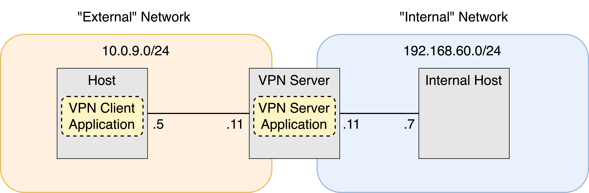
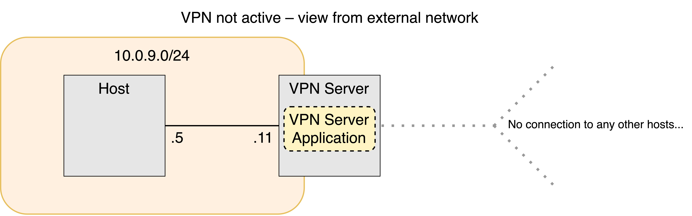

# VPN Project
VPN implementation in Python for Linux (and potentially other Unix-like operating systems).

Please see the [user documentation PDF](user_documentation.pdf) for a more detailed overview on the core VPN project.

For more detailed information on Post-Quantum Cryptography and mTLS, see below.

### Architecture overview
The core VPN is deployed in preconfigured Docker containers running Linux across two private networks (Class A and Class C), there is no router or any fancy networking between the two networks. See the diagrams below to understand this structure.




The GUI cannot be run inside of Docker without making changes to how the Docker containers run. For testing, we've opted to go down the VM route.

### Running the VPN
```shell
version="RSA" # Select version, use "RSA", "QUIC", "X25519" or "ML-KEM"

docker-compose build
docker-compose up -d

# Generate RSA keys for RSA version
mkdir keys
openssl genrsa -out keys/RSA/server_private.pem 2048
openssl rsa -in keys/RSA/server_private.pem -outform PEM -pubout -out keys/server_public.pem
openssl genrsa -out keys/RSA/client_private.pem 2048
openssl rsa -in keys/RSA/client_private.pem -outform PEM -pubout -out keys/client_public.pem

# Generate keys for X25519 version
mkdir keys
openssl genpkey -algorithm X25519 -out keys/X25519/x-server_private.pem
openssl pkey -in keys/x-server_private.pem -pubout -out keys/X25519/x-server_public.pem
openssl genpkey -algorithm X25519 -out keys/X25519/x-client_private.pem
openssl pkey -in keys/x-client_private.pem -pubout -out keys/X25519/x-client_public.pem

# Generate keys for ML-KEM version
mkdir keys
python3 tools/keygen.py

# Note that key generation is not necessary before running the QUIC version due to differences in this version's structure.

# Validate no connectivity between client and internal host
docker exec -it client-10.9.0.5 ping 192.168.60.7

# Start VPN client and server
docker exec -it client-10.9.0.5 env PYTHONPATH=/volumes python3 /volumes/client/${version}_client.py & # Using a console version
docker exec -it server-router env PYTHONPATH=/volumes python3 /volumes/server/${version}_server.py &

# If running the GUI, run the following from the client machine.
env PYTHONPATH=/volumes python3 /volumes/client/GUI.py 

# Validate the connectivity between client and internal host
docker exec -it client-10.9.0.5  ping 192.168.60.7
```
Benchmarking needs to be run from the src directory, and should be run on the host machine (not within the containers). It is recommended to create a virtual environment on the machine and run benchmarking using that.

To perform benchmarking, run the `benchmark.sh` (Linux/Bash) or `benchmark.ps1` (Windows/Powershell) scripts. 

### Creating a local Wireguard connection for comparison testing
Assumptions:
- Devices are on same local network
- IP addresses are 192.168.55.50 and 192.168.55.51


```ini
# Device 1
[Interface]
PrivateKey = # Put a key here
ListenPort = 51820
Address = 10.0.0.1/24

[Peer]
PublicKey = # Put a key here
AllowedIPs = 10.0.0.2/32
Endpoint = 192.168.55.51:51820
PersistentKeepalive = 25

# Device 2
[Interface]
PrivateKey = # Put a key here
ListenPort = 51820
Address = 10.0.0.2/24

[Peer]
PublicKey = # Put a key here
AllowedIPs = 10.0.0.1/32
Endpoint = 192.168.55.50:51820
PersistentKeepalive = 25
```

### Extra functionality
- Working PQC implementation using Open Quantum Safe/LibOQS.
- Fully working Graphical User Interface which hooks into backend versions to form a connection for clients.
- Structural improvements to code, allowing for one set of docker containers to be used across all VPN versions.
- Real time performance monitoring between VPN clients and their connected server

### Post-Quantum Cryptography
This project uses LibOQS (and more specifically the Python bindings the Open Quantum Safe (OQS) organization provides) to provide access to an audited, open source implementation of the ML-KEM algorithm, also previously known as CRYSTAL-Kyber. This is a Key Encapsulation Method built on top of Module Lattices, creating an asymmetric cryptosystem. Lattices are a mathematical structure analogous to a grid, and this algorithm works by performing polynomial operations within this grid space. Security from the algorithm comes from the fact that being able to read a message without the private key is equivalent in difficulty to a 'Module Learning with Error' problem, which is believed to be very difficult for both classical and quantum computers to solve. Because of this, security is guaranteed even into the future where developments in quantum computing technology will inevitably break traditional asymmetric cryptographic algorithms.

Encryption works by encoding each byte of the plaintext (which is limited to 32 bytes or 256 bits in size) as the coefficients of a polynomial. Noise based on the recipient's public key is included as well, with the idea being that this noise can only be removed from the ciphertext using the recipient's private key. Keys are created by sampling points in the space of the lattice, and operations within the algorithm are conducted with polynomial vector operations. See the standard for further explanation of how the system works in it's entirety.

### GUI
The GUI is built in Python, using TKinter. The GUI file does not have any VPN/Networking logic; when the VPN is enabled, the console-based client program is started as a subprocess of the GUI, and the GUI stops this subprocess when the VPN gets turned off.
---

##### References  
  
###### Australian Cyber Security Centre. (2025). *Information security manual (ISM) (March 2025 ed.).* Australian Signals Directorate. https://www.cyber.gov.au/resources-business-and-government/essential-cybersecurity/ism

###### Jing, J., Helal, A. S., & Elmagarmid, A. (1999). *Client-server computing in mobile environments.* ACM Computing Surveys (CSUR), *31(2)*, 117-157. [https://doi.org/10.1145/319806.31981](https://doi.org/10.1145/319806.31981)  

###### National Institute of Standards and Technology (NIST). (2024). *Module-Lattice-Based Key-Encapsulation Mechanism Standard.* [https://doi.org/10.6028/NIST.FIPS.203](https://doi.org/10.6028/NIST.FIPS.203)
